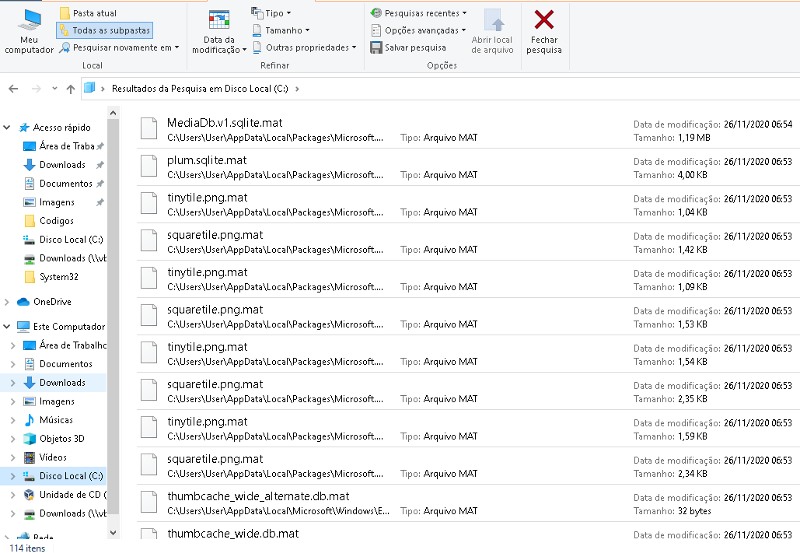
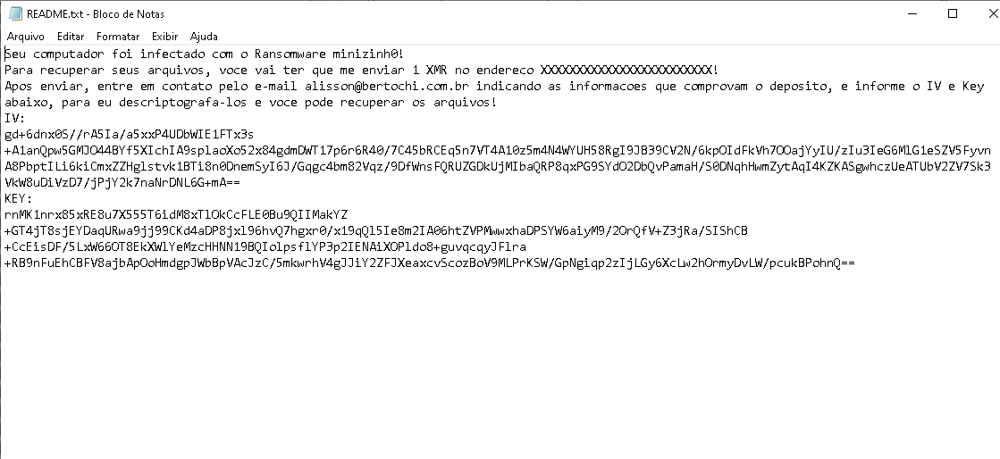

## minizinh0-FUD - A Fully Undetectable Ransomware 

### Introduction

In October, just 4fun, I implemented a generic ransomware called **minizinh0**, which is cross-platform and compiles to Windows and Linux. It has not yet been released, but maybe I will post its source here on my GitHub. 

I did a test running this first version against Kaspersky Cloud Security 21.2.16.590, and it takes around 2 minutes to be detected and blocked by the behavior analysis system. You can see the test [in this video](https://youtu.be/M3qOuKtSS30). The result was a compromise of 114 files (in my opinion, a big damage!), as can be seen below:

Anyway, despite the damage, I don't like to lose to AVs, so I decided to use the technique of User Imitation, which I did a [PoC Fully UnDetectable](https://github.com/gnxbr/Fully-Undetectable-Techniques/tree/main/user-imitating) some days ago, to make a FUD Ransomware called "minizinh0-FUD". I got the core idea from Tim's paper and created my version using my minizinh0 "non-FUD" as a template. The result was a success! I was able to encrypt the filesystem under the nose of the Antivirus (heh).

Because I think we'll see something like this being used in the wild soon, **I decided to release the PoC before the criminal minds start using, so the good guys will have time to think about solutions.**

I didn't implement most of the real features of a Ransomware, like deleting shadow copies, finding other partitions and shared network drives, one key attached per file, etc. It's just a PoC (maybe with some bugs)! :)

### How it works

minizinh0-FUD works on a hidden secondary desktop. It takes the path of the current user, and starts walking X levels (configurable) in-depth, looking for files with extensions that are on the list: docx|pdf|xlsx|pptx|ppsx|kdbx|sqlite|zip|rar|jpg|png|html|htm. When a target file is found, the ransomware copies it (simulating the user) to %TEMP%\temp.png, opens it (ReadFile), encrypts it and saves (WriteFile) to %TEMP%\temp.mp3. Next, it moves (simulating the user) the file temp.mp3 (target file encrypted) to the Original Path + .mat extension (e.g., C:\important-file.db.mat), creates a Ransom Note in the directory with the echo command, and go to the next one.

I'm encrypting the Key and IV of AES-CBC 128-bit with my RSA Public Key 2048-bit. I use the same Key/IV for all files. By decrypting it, the victim can recover their files.

One of the disadvantages of minizinh0-FUD, is that the process of encrypting each file takes more time than a "normal ransomware" because as we always use the same names, we have to wait for the file "to be released" before moving on to the next one.

### minizinh0-FUD demo, my revenge against Kaspersky (and all the others), have fun :)

[PoC Video](https://youtu.be/2a4wEv9FcmA) (ignore the debugging messages)

### One of the folders encrypted by minizinh0-FUD

Notice that I'm not deleting the original files.

### My Ransom Note (in pt-br)

### Source

Use it to think about solutions in how to defeat this very cool technique!

[minizinh0-FUD.c](src/minizinh0-FUD.c)

### Get in touch

If you wanna talk more about these techniques, get in touch via IRC (gnx @ freenode), Telegram (@gnxbr) or e-mail (alisson[at]bertochi[.]com[.]br).

